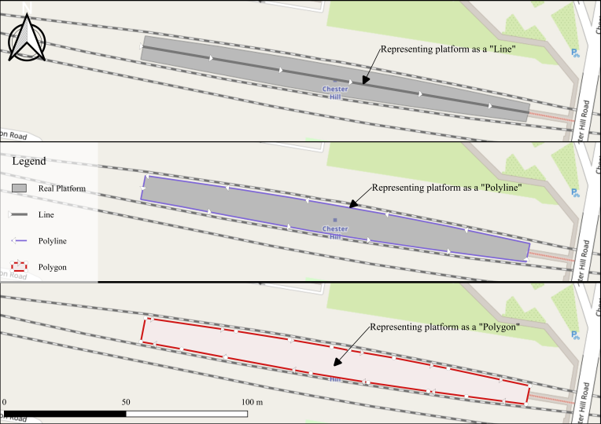
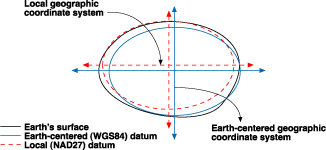

```{r, include=FALSE}
knitr::opts_chunk$set(
  collapse = TRUE, 
  warning = FALSE,
  message = FALSE
)
```

## Pengenalan #rspatial

### Representasi Objek Nyata dalam Komputer

#### 1. Simple features

Menjelaskan bagaimana objek-objek dalam dunia nyata bisa diwakilkan ke dalam komputer, dengan penekanan pada bentuk (geometri) spasial objek tersebut.

- *geometry* berhubungan dengan bentuk benda/objek dan posisinya di permukaan Bumi.
- *attributes* menjelaskan sifat-sifatnya (properties) atau keterangan tambahan, biasanya dalam bentuk tabular.

Geometri yang sering digunakan adalah dalam dimensi 2, seperti:

- titik (point), misal: lokasi
- garis (linestring), misal: jalan, batas wilayah
- poligon (polygon), misal: luas area, kawasan hutan



#### 2. Coordinate Reference System (CRS)

Menjelaskan kedudukan benda/objek di muka Bumi.

- Proyeksi, misal: longlat, UTM, geocent
- Datum, misal: WGS 84, NAD27, etc.

Cara-cara proyeksi:


Apa sebenarnya datum?



### Library `sf`

`sf`: Simple Features for R

- menggunakan format tabel (data.frames atau tibbles) lengkap dengan geometry dan CRS-nya
- semua besar fungsi dimulai dengan `st_` sehingga mudah menggunakan *tab completion* di RStudio
- fungsi-fungsi dari `sp`, `rgeos`, `rgdal` bisa dilakukan di `sf`
- ramah terhadap `dplyr` dan `tidyr`

## Requirements (Tools)

**Windows:**

- R | [unduh](https://cran.r-project.org/)
- RStudio | [unduh](https://rstudio.com/products/rstudio/download/)
- Rtools | [unduh](https://cran.r-project.org/bin/windows/Rtools/)

**Linux & MacOS:**

- R
- RStudio | [unduh](https://rstudio.com/products/rstudio/download/)
- GDAL, GEOS, PROJ | [konfigurasi](https://r-spatial.github.io/sf/#installing)

*Instalasi R di Ubuntu*

```{}
sudo apt-get update
sudo apt-get install r-base
```

**Library (Windows, MacOS, Linux):**

```{r muat package diperlukan, message=FALSE, warning=FALSE}
if(!require("sf")) install.packages("sf")
if(!require("dplyr")) install.packages("dplyr")
if(!require("rnaturalearth")) install.packages("rnaturalearth")
if(!require("mapview")) install.packages("mapview")
```

## Data Preparation

Pada meet up lalu, kita telah belajar tentang cara mendapatkan data titik sebaran lokasi rumah sakit dari webgis menggunakan R library `esri2sf`.

Muat data tersebut dari file .rds yang ada di dalam folder data:

```{r muat data}
rs <- readRDS("data/data.rds")
```

Mengetahui kelas data/objek dan strukturnya:

```{r struktur data}
class(rs)
print(rs, n = 5)
```

## Plot Data Spasial Menggunakan `sf`

Secara default kita bisa menampilkan data spasial menggunakan library `sf`.

**1. Cara plot objek kelas `sf`**

```{r plot sf}
plot(st_geometry(rs))
```

**2. Plot data lokasi RS ke peta Indonesia**

```{R plot data ke peta indonesia}
id <- rnaturalearth::ne_countries(country = "indonesia", returnclass = "sf")
plot(st_geometry(id))
plot(st_geometry(rs), add = TRUE)
```

**3. Menampilkan lokasi RS di wilayah Pontianak**

Kita juga bisa menggunakan data ESRI Shapefile (format .shp):

```{r plot data ke peta pontianak}
# Memuat peta Kota Pontianak
pontianak <- read_sf("data/peta/pontianak_kota.shp")
plot(st_geometry(pontianak), graticule = TRUE, axes = TRUE)
```

Membatasi data RS hanya untuk wilayah Pontianak:

```{r bbox}
bb_pontianak <- st_bbox(pontianak)

library(dplyr)
rs %>% 
  st_crop(bb_pontianak) %>% 
  st_geometry() %>% 
  plot(add = TRUE)
```

Untuk peta yang lebih interaktif:

```{r}
library(mapview)
mapview(rs)
```

**4. Transformasi referensi koordinat (CRS)**

Memperoleh informasi CRS dari data sebaran RS dan peta:

```{R}
st_crs(rs)
st_crs(pontianak)
```

Untuk mengubah CRS ke nilai tertentu, lakukan:

```{R definisikan crs}
crs.id <- 23838 # ambil dari web epsg.io

rs.id <- st_transform(rs, crs.id)
pontianak.id <- st_transform(pontianak, crs.id)

st_crs(rs.id)
st_crs(pontianak.id)

pontianak %>% 
  st_geometry() %>% 
  plot(graticule = TRUE, axes = TRUE)
```

Lalu di mana letak perbedaannya? Mari kita telaah:

```{R perbedaan units pada bbox}
st_bbox(rs)
st_bbox(rs.id)
```

Apa yang berbeda?

**5. Membuat buffer area**

Klasifikasi wilayah untuk analisis pola jangkauan masyarakat ke fasilitas pelayanan kesehatan adalah sebagai berikut:

- 0-1000 meter, sangat dekat
- 1001-2000 meter, sedang
- 2001-3000 meter, jauh
- >3000 meter, tidak terjangkau

Membuat batas area:

```{r membuat buffer area}
dekat <- st_buffer(st_geometry(rs.id), dist = 1000)
sedang <- st_buffer(st_geometry(rs.id), dist = 2000)
jauh <- st_buffer(st_geometry(rs.id), dist = 3000)

aoi <- st_bbox(pontianak.id)

pontianak.id %>% 
  st_geometry() %>% 
  plot(border = "gray")

rs.id %>%
  st_crop(aoi) %>% 
  st_geometry() %>% 
  plot(add = TRUE)

dekat %>%
  st_crop(aoi) %>% 
  st_geometry() %>% 
  plot(add = TRUE, border = "green")

sedang %>%
  st_crop(aoi) %>% 
  st_geometry() %>% 
  plot(add = TRUE, border = "blue")

jauh %>%
  st_crop(aoi) %>% 
  st_geometry() %>% 
  plot(add = TRUE, border = "red")

```

**5. Plot dengan `ggplot2`**

```{r plot ggplot2}
library(ggplot2)
ggplot() +
  geom_sf(data = pontianak) +
  theme_bw() +
  geom_sf(data = st_crop(rs, bb_pontianak))
```

Sekian. Terima kasih. Nanti kita modifikasi lagi.

```{r ggmap, eval=FALSE, include=FALSE}
library(ggplot2)
library(ggmap)
library(sf)

#our background map
lon = 109
lat = 0.05
pontianak_map <- get_map(center = c(lon,lat))

#final map
ggmap(mad_map)+
  geom_sf(data=st_geometry(rs),
          inherit.aes =FALSE,
          colour="#238443",
          fill="#004529",
          alpha=.5,
          size=4,
          shape=21)+
  labs(x="",y="")
```


## Referensi dan Bahan Bacaan

- Penjelasan tentang olah data spasial | [intro gis with R](https://www.jessesadler.com/post/gis-with-r-intro/)
- Kata Wikipedia tentang [simple features](https://en.wikipedia.org/wiki/Simple_Features)
- Penjelasan tentang `sf` | [dokumentasi](https://cran.r-project.org/web/packages/sf/vignettes/sf1.html)
- Modifikasi data spasial kelas `sf` | [tidy sf](http://strimas.com/r/tidy-sf/)
- Cara menggunakan `esri2sf` | [Materi meet up lalu oleh @wanulfa](https://github.com/wanulfa/argis-server)
- Plotting peta dengan `sf` dan `ggplot2` | [artikel](https://www.r-bloggers.com/zooming-in-on-maps-with-sf-and-ggplot2/)
- Buku [Geocomputational in R](https://geocompr.robinlovelace.net/spatial-class.html) oleh Robin Lovelace & Jakub Nowosad

**Gambar:**

- Perbandingan objek geometri oleh [Levinson](https://transportist.org/2019/11/06/catchment-if-you-can-the-effect-of-station-entrance-and-exit-locations-on-accessibility/)
- Proyeksi peta oleh [Battersby, S.](https://gistbok.ucgis.org/bok-topics/map-projections)
- Datum dari ArcGIS